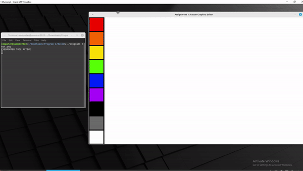
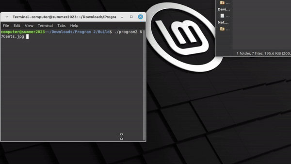
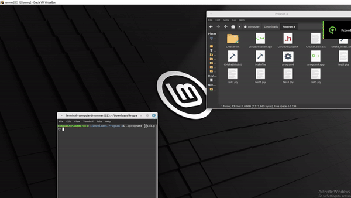

# ComputerVisionProjects

### Table of Contents
1. [Description](#Description)
2. [PrimitivePaintApplication](#PrimitivePaintApplication)
3. [CoinCountingApplication](#CoinCountingApplication)
4. [BoxDimensionCalculator](#BoxDimensionCalculator)

## Description
This repository is a collection of mini computer vision projects completed over the summer of 2023. These were developed on a 64-bit Ubuntu machine.

## PrimitivePaintApplication
This program is a very primitive version of Paint installed on Windows machines.

### Features
Left-click to toggle through features. Right-click to use the selected tool.
* Eyedropper Tool: Click to select the color you would like to draw with.
* Pencil Tool: Hold and drag the mouse to draw with the selected color.
* Paint Buck Tool: Click the desired area to fill with the selected color.
* Crop Tool: Click in the top left corner and hold to the bottom right corner or desired crop area.
* Reset Tool: Double-click to reset the image back to default.

### Demo 

## CoinCountingApplication
This program counts the amount of money in coins from images. The total is output in the terminal and the coin types are outlined in their respective colors. Pennies are red, nickles are yellow, dimes are blue, and quarters are green. Pictures must be taken from the same distance and angle to work properly. You can adjust the values on lines 79, 85, 91, and 97 to fit your image set.

### Features
* Outlines coin types with their respective colors.
* Counts the number of each type of coin in the image.
* Calculates the total money in the image.

### Demo

## BoxDimensionCalculator
This program identifies boxes on a table and calculates their dimensions from .ply files taken from above at a ~90 degree angle to the table top.

### Features
* Identifies the table plane and colors it blue.
* Identifies the tops of boxes and colors them red or blue.
* Calculates the dimensions of each box.
* Navigating the point cloud
  * Middle Mouse Scroll OR Right Mouse Hold and Drag - Zoom in or out.
  * Middle Mouse Scroll Hold and Drag - Change angle.
  * Left Mouse Hold and Drag - Rotate around the center.

### Demo

## VideoGameGemIdentifier
This program uses template matching to identify the gems in a video taken from a video game. It uses an image of a gem as a template and identifies each gem in the video.

### Features
* Identifies gems and tracks gems on screen.
* Identifies the color of each gem and outlines them with the respective color.

### Demo

